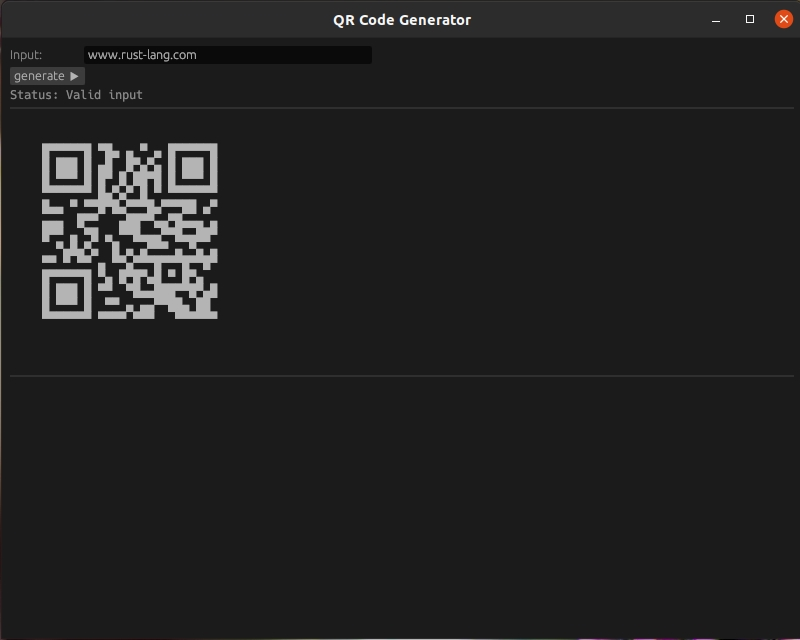

# qr2text v1

## Description

 A program to render a QR code as plain text, using block symbols.

 Based on:

 * [qr2text](https://github.com/wapm-packages/qr2text)




## Dependencies

* [egui](https://github.com/emilk/egui)


## Build and run

```
cargo build --release

cargo run --release
```

## Author

* [Antonio Soares](https://github.com/ccie18473)

## License

This project is licensed under the [MIT] License - see the LICENSE.md file for details
